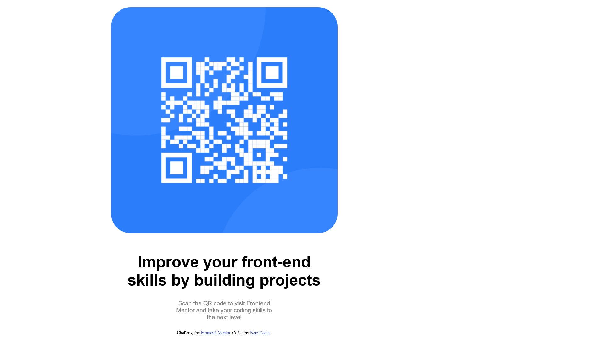

# Frontend Mentor - QR code component solution

This is a solution to the [QR code component challenge on Frontend Mentor](https://www.frontendmentor.io/challenges/qr-code-component-iux_sIO_H). Frontend Mentor challenges help you improve your coding skills by building realistic projects. 

## Table of contents
  - [Screenshot](#screenshot)
  - [Links](#links)
- [My process](#my-process)
  - [Built with](#built-with)
  - [What I learned](#what-i-learned)
  - [Continued development](#continued-development)
  - [Acknowledgements]
  - [Useful resources](#useful-resources)


### Screenshot

 /*First solution*/
/*Second Solution*/

### Links

- Solution URL: [Add solution URL here](https://github.com/NeonCodes/Qrcodechallenge)
- Live Site URL: [Add live site URL here](https://qrcodechallenge-neoncodes.netlify.app)

## My process

### Built with

- Semantic HTML5 markup
- CSS stylesheets and flexbox


### What I learned
Solution 1
I learned that sometimes the solution is simpler than you may think:
 I spent a significant amount of time wondering:1 how to move the second half of the text to the bottom: I though I had to use some complex CSS code or something. After first googling it, I used a <pre></pre>tag.
2- Later, after looking at the picture of the final result, I realised there was too much space between the two lines in the title. Again, went thinking it was CSS related. I ended googling it again and found the <br> tag--which, for some mysterious reason, I forgot existed--, and that ended up fixing it.
I also googled how to make the image's corners round.

Solution 2
1- Receiving feedback and having the right resources can save a huge a amount of time
2- I should have used the complete Figma design file from the start (didn't notice there were multiple pages to it at first)

To see how you can add code snippets, see below:

```css
proud of 

```

If you want more help with writing markdown, we'd recommend checking out [The Markdown Guide](https://www.markdownguide.org/) to learn more.


### Continued development
I realised while I got HTML basics mostly covered, I still need to work more on CSS(especially the box model and more flexbox)

### Useful resources

- [Microsoft Edge](the search engine)- This helped me, along with Copilot, to find solutions to simpler coding problems:  line breaks(1st solution submitted),Css basic reset
- [web.dev](https://www.web.dev) - The CSS sections: article about the box model:(https://web.dev/learn/css/box-model?continue=https%3A%2F%2Fweb.dev%2Flearn%2Fcss%23article-https%3A%2F%2Fweb.dev%2Flearn%2Fcss%2Fbox-model). 

-[LANDMARKS]
(https://dequeuniversity.com/rules/axe/4.6/region?application=axeAPI)- For fixing basic Html landmarks. Recommended by FM;

[FLEXBOX]
(https://css-tricks.com/snippets/css/a-guide-to-flexbox/)- Recommended by a FM user. It helped get a better grasp of flexbox. 

(https://autoprefixer.github.io/)- For a more browser friendly flexbox use. It recommended extra prefixes.

[Calculatorway]
(https://www.calculatorway.com/px-to-rem-converter/)- To convert px to rem.

